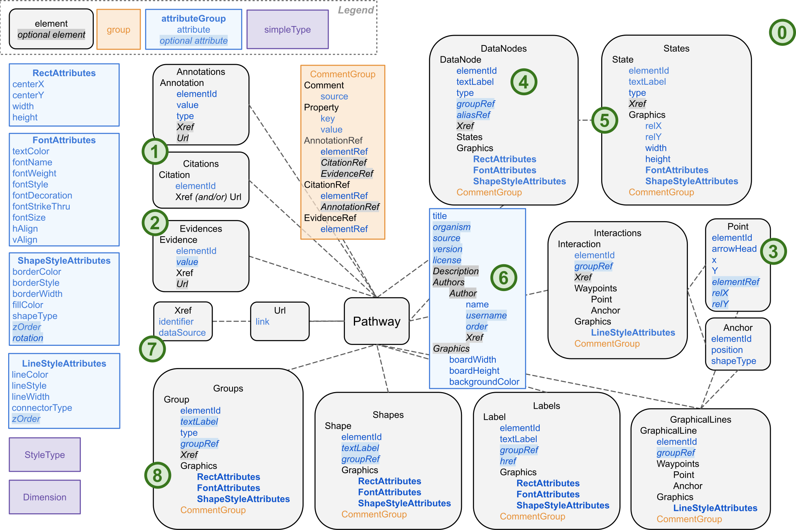

# About GPML2021

### What's new? 
* [Streamlined Annotations, Citations, and Evidences &#9312;](#streamlined-annotations-citations-and-evidences)
* [New Evidence Code &#9313;](#new-evidence-code)
* [Updated Extensible Type Definitions &#9450;](#updated-extensible-type-definitions)
* [New Interaction Panel &#9314;](#new-interaction-panel)
* [DataNode Type Alias and Attribute AliasRef &#9315;](#datanode-type-alias-and-attribute-aliasref)
* [States Nested in DataNodes &#9316;](#states-nested-in-datanodes)
* [Pathway Author Element &#9317;](#pathway-author-element)
* [Graphics Customization &#9450;](#graphics-customization)
* [Xref DataSource as Compact Identifier Prefix &#9318;](#xref-datasource-as-compact-identifier-prefix)
* [Merged Group GroupId and GraphId &#9319;](#merged-group-groupid-and-graphid)
* [Removed Unused Elements and Attributes &#9450;](#removed-unused-elements-and-attributes)
* [Modified Schema Format and Structure &#9450;](#modified-schema-format-and-structure)


<a name="map"></a>
<div>
<p align="center">
  
  <br>
  <em>Figure 1: GPML2021 Schema Diagram</em>
</p>
</div>

### Streamlined Annotations, Citations, and Evidences 
### [&#9312;](#map)
In GPML2021, [Annotation/AnnotationRef](#annotation-and-annotationref) and [Citation/CitationRef](#citation-and-citationref) replaces Biopax OpenControlledVocabulary and PublicationXref/BiopaxRef respectively. Annotations and Citations of a Pathway are written at the end of a GPML, and are referenced using AnnotationRefs and CitationRefs of the Pathway or pathway elements. These new GPML2021 features allow more flexibility in annotating individual pathway elements. And are an improvement on GPML2013a for which Annotations/OpenControlledVocabulary could only be linked to the Pathway and not to individual pathway elements.

AnnotationRef and CitationRef are grouped in CommentGroup along with Comment, Property, and [EvidenceRef](#new-evidence-code).  DataNodes, States, Interactions, GraphicalLines, Labels, Shapes, and Groups can all have CommentGroup. In addition, CitationRefs and EvidenceRefs can be nested in AnnotationRefs; and AnnotationRefs can be nested in CitationRefs to provide related information. 

Related Read: [Guide to Adding Annotations, Citations, and Evidences](Guide_Add_Annotation_Citation_Evidence.md)

#### Annotation and AnnotationRef
An Annotation has: 
* elementId
* value
* type (e.g. Ontology)
* *Xref (optional)* 
* [*Url*](#url) *(optional)* 

An AnnotationRef has:
* elementRef (refers to the elementId of the parent Annotation referenced) 
* *CitationRef(s) (optional, refers to the elementId of Citation(s) which support the parent Annotation)*
* *EvidencRef(s) (optional, refers to the elementId of Evidence(s) which support the parent Annotation)*

***GPML2013a OpenControlledVocabulary compared with GPML2021 Annotation:*** 

*Example of GPML2013a OpenControlledVocabulary*
```
<Biopax>
    <bp:openControlledVocabulary xmlns:bp="http://www.biopax.org/release/biopax-level3.owl#">
        <bp:TERM xmlns:rdf="http://www.w3.org/1999/02/22-rdf-syntax-ns#" rdf:datatype="http://www.w3.org/2001/XMLSchema#string">thyroid cancer</bp:TERM>
        <bp:ID xmlns:rdf="http://www.w3.org/1999/02/22-rdf-syntax-ns#" rdf:datatype="http://www.w3.org/2001/XMLSchema#string">DOID:1781</bp:ID>
        <bp:Ontology xmlns:rdf="http://www.w3.org/1999/02/22-rdf-syntax-ns#" rdf:datatype="http://www.w3.org/2001/XMLSchema#string">Disease</bp:Ontology>
    </bp:openControlledVocabulary>
    ...
</Biopax>
```
*Example of GPML2021 Annotation and AnnotationRef*
```
<Annotations>
    </Annotation>
        <Annotation elementId="a2" name="thyroid cancer" type="Disease">
        <Xref identifier="1781" dataSource="DOID"/>
	<Url link="https://identifiers.org/DOID:1781"/>
    </Annotation>
</Annotations>

<AnnotationRef elementRef="a2">
    <CitationRef elementRef="cbc" />
    <EvidenceRef elementRef="evd" />
</AnnotationRef>
```
#### Citation and CitationRef

A Citation has:
* elementId
* Xref and/or [*Url*](#url)

From a Citation Xref all information about a publication can be found. Therefore, publication details (e.g. author, title) are not written in GPML2021. 

A CitationRef has:
* elementRef (refers to the elementId of the parent Citation referenced) 
* *AnnotationRef(s) (optional, refers to the elementId of Annotation(s) which support the parent Citation)*


***GPML2013a PublicationXref compared with GPML2021 Citation:*** 

*Example of GPML2013a PublicationXref and BiopaxRef*
```
<Biopax>
    <bp:PublicationXref xmlns:bp="http://www.biopax.org/release/biopax-level3.owl#" 
        xmlns:rdf="http://www.w3.org/1999/02/22-rdf-syntax-ns#" rdf:id="cbc">
        <bp:ID rdf:datatype="http://www.w3.org/2001/XMLSchema#string">7730304</bp:ID>
        <bp:DB rdf:datatype="http://www.w3.org/2001/XMLSchema#string">PubMed</bp:DB>
        <bp:TITLE rdf:datatype="http://www.w3.org/2001/XMLSchema#string">Isotopomer analysis of citric acid cycle and 
        gluconeogenesis in rat liver. Reversibility of isocitrate dehydrogenase and involvement of ATP-citrate lyase in 
        gluconeogenesis.</bp:TITLE>
        <bp:SOURCE rdf:datatype="http://www.w3.org/2001/XMLSchema#string">J Biol Chem</bp:SOURCE>
        <bp:YEAR rdf:datatype="http://www.w3.org/2001/XMLSchema#string">1995</bp:YEAR>
        <bp:AUTHORS rdf:datatype="http://www.w3.org/2001/XMLSchema#string">Des Rosiers C</bp:AUTHORS>
        <bp:AUTHORS rdf:datatype="http://www.w3.org/2001/XMLSchema#string">Di Donato L</bp:AUTHORS>
        <bp:AUTHORS... 
    </bp:PublicationXref>
    ...
</Biopax>

<BiopaxRef>cbc</BiopaxRef>
```
*Example of GPML2021 Citation and CitationRef*
```
<Citations>
    <Citation elementId="cbc">
        <Xref identifier="7730304" dataSource="pubmed"/>
        <Url link="https://identifiers.org/pubmed:7730304"/>
    </Citation>
    ...
</Citations>

<CitationRef elementRef="cbc">
    <AnnotationRef elementRef="a2" />
</CitationRef>
```
#### Url 
An Url has: 
* link


### New Evidence Code
### [&#9313;](#map)
New elements Evidence and EvidenceRef (reference to an Evidence) are introduced for the annotation of Evidence Codes.
Evidences of a Pathway are written at the end of a GPML after Annotations and Citations, and are referenced using EvidenceRefs. EvidencRef is grouped in CommentGroup along with [AnnotationRef](#annotation-and-annotationref), [CitationRef](#citation-and-citationref), Comment, and Property.  DataNodes, States, Interactions, GraphicalLines, Labels, Shapes, and Groups can all have CommentGroup. EvidenceRef can also be nested in an [AnnotationRef](#annotation-and-annotationref) element. 

An Evidence has:
* elementId
* Xref (e.g. [Evidence Code Ontology](https://evidenceontology.org/))
* *value (optional, e.g. term or text)*
*  [*Url*](#url) *(optional)* 

An EvidenceRef has:
* elementRef (refers to the elementId of the parent Evidence referenced) 

*Example of GPML2021 Evidence and EvidenceRef*
```
<Evidences>
    <Evidence elementId="evd" value="experimental evidence">
        <Xref identifier="0000006" dataSource="ECO"/>
        <Url link="https://identifiers.org/ECO:0000006"/>
   </Evidence>
    ...
</Evidences>

<EvidenceRef elementRef="evd" />
```
### Updated Extensible Type Definitions 
### [&#9450;](#map)
New categories for DataNode (Molecules vs. Concepts), State, Group, and Annotation types are defined. As well as enumeration types for connectorType, StyleType, and Anchor shapeType. All Types are extensible with type string and written in UpperCamelCase format.  

| DataNode type       |              |State type              | Group type      | Annotation type     |
| :---                | :---         |:---                    | :---            |:---                 |
| Undefined (default) |              |Undefined (default)     | Group (default) | Undefined (default) |
| ***Molecules:***    | ***Concepts:***|ProteinModification  | Complex       | Ontology            |
| GeneProduct         | Pathway      |GeneticVariant         | Pathway         | Taxonomy            |
| DNA                 | Disease      |EpigeneticModification | Analog          |     |
| RNA                 | Phenotype    |                        | Paralog         |                     |
| Protein             | Alias        |                        |                 |                     |
| Complex             | Event        |                        |                 |                     |
| Metabolite          |              |                        |                 |                     |

<br/>

| ConnectorType      | Line/BorderStyle) |  Anchor shapeType  |
| :---               | :---              | :---               |
| Straight (default) | Solid (default)   | Square (default)   |
| Elbow		           | Dashed            | Circle             |
| Curved             | Double            | None               |
| Segmented          |                   |                    |

Additionally, LineStyle "Double" and CellularComponent shapeTypes enumeration types are cleaned up so that such information no longer needs to be stored in key-value pair Property.  


### New Interaction Panel
### [&#9314;](#map)
A new Interaction Panel (Interaction or Line arrowHead type) is introduced. ArrowHead type is extensible with type string and written in UpperCamelCase format. Plugins will be available for: 
* Molecular Interaction Map (MIM)
* Systems Biology Graphical Notation (SBGN)

The GPML Interaction Panel ArrowHead types can be mapped to equivalent Old ArrowHead Types and MIM ArrowHead types. 


| Interaction Panel | Old type | MIM ArrowHead type|
|:---|:---|:---|
|Undirected (default)|  Line |  |
|Directed|  Arrow |  |
|Conversion|  | mim-conversion;  mim-modification, mim-cleavage, mim-gap, mim-branching-right, mim-branching-left |  
|Inhibition| TBar | mim-inhibition |
|Catalysis|  | mim-catalysis |
|Stimulation|  | mim-stimulation; mim-necessary-stimulation |
|Binding|  | mim-translocation |
|Translocation|  | mim-transcription-translation |
|Transcription-translation|  |  |


Because there are many more SBGN ArrowHead types, they are not mapped to the GPML Interaction Panel. The SBGN Plugin handles SBGN Arrowhead types. 


### DataNode Type Alias and Attribute AliasRef
### [&#9315;](#map)
An Alias for a Group can be represented by a DataNode with type="Alias" and aliasRef referring to the elementId of the parent Group. 

*Example of GPML2021 Group and DataNode Alias:* 
```
<DataNode elementId="c27d1" aliasRef="d4107" textLabel="Alias_for_abc" .../>

<DataNode elementId="ed3f8" textLabel="DataNode" type="GeneProduct" groupRef="d4107"  .../ >

<Label elementId="e180c"  textLabel="group_abc" groupRef="d4107".../>

<Group elementId="d4107" style="Complex".../>

```
Nested Groups are also possible by utilizing DataNode as Aliases.  

*Example of GPML2021 Nested Groups and DataNode Aliases:* 
```
  <DataNode elementId="a1" elementRef="efg" textLabel="Alias_for_efg" />
  <DataNode elementId="a2" elementRef="abc" groupRef="efg" textLabel="Alias_for_abc" />
  <DataNode elementId="a3" elementRef="abc" textLabel="Alias_for_abc" />

  <DataNode elementId="n1" groupRef="abc" textLabel="DataNode;" type="GeneProduct" .../>
  <DataNode elementId="n2" groupRef="efg" textLabel="DataNode;" type="GeneProduct" .../>
  <Label elementId="n3" groupRef="abc" textLabel="group_abc" .../>
  <Label elementId="n4" groupRef="efg" textLabel="group_efg".../>

  <Group elementId="abc" Style="Complex" textLabel="GroupABC" groupRef="efg" />
  <Group elementId="efg" Style="Complex" textLabel="GroupEFG" />
```


### States Nested in DataNodes
### [&#9316;](#map)
Given that a State is always linked to a DataNode, States are moved to be nested inside of DataNodes in GPML2021. 

*Example of GPML2021 DataNode with States:* 
```
<DataNodes>
    <DataNode elementId="b4d99" textLabel="ERBB2" type="GeneProduct">
        <Xref identifier="ENSG00000141736" dataSource="ensembl" />
        <States>
            <State elementId="c0d56" textLabel="+" type="Undefined">
              <Graphics ... />
            </State>
            ...
      </DataNode>
</DataNodes>
```


### Pathway Description and Author Elements 
### [&#9317;](#map)
The Description element stores the pathway textual description (previously stored in a Comment element). 

*Example of GPML2021 Description:* 
```
...
<Description> textual description for pathway </Description
...
```

The Author elements nested in Authors allows the storing of pathway author information, including: 
* name
* *username (optional)*
* *order (optional, authorship order)*
* *Xref (optional, e.g. ORCID iD)*

*Example of GPML2021 Authors:* 
```
<Authors>
		<Author name="Mkutmon" username="Martina Kutmon" order="1">
			<Xref identifier="0000" dataSource="orcid"/>
		</Author>
		<Author name="Egonw" username="Egon Willighagen" order="2"/>
	  ...
</Authors>
```


### Graphics Customization
### [&#9450;](#map)
Additional customization of graphics (e.g. color, shape) is now possible. 
* Different colors can be specified for borderColor and textColor 
* New shapeTypes 
* Background color can be defined for pathway 
* Group has added graphics properties (RectAttributes, FontAttributes, ShapeStyleAttributes) 
* State has added font properties (FontAttributes)
* Rotation is optionally added for DataNode, State, Label, Shape, and Group.


### Xref DataSource as Compact Identifier Prefix
### [&#9318;](#map)
Xref dataSource(s) will be retrieved from [BridgeDb](https://bridgedb.github.io/), and it is also possible to register new data sources. The DataSource compact identifier prefix is given priority and written for by default GPML2021 format (in contrast, DataSource full name is written by default for GPML2013a).  See registered BridgeDB [datasources](https://github.com/bridgedb/datasources/blob/main/datasources.tsv). Additionally, Xref is added for the Pathway. 

*Example of GPML2021 Pathway Xref:* 
```
  <Xref identifier="WP1_r1" dataSource="wikipathways"/>
```


*For Example:* 

| identifier| compact identifier prefix | full name | system code |
| :--- | :--- | :--- | :--- |
|ENSG00000139618| ensembl | Ensembl | En | 

### Merged Group GroupId and GraphId
### [&#9319;](#map)
Group Element previously had both GroupId and GraphId, identification of Groups are merged into just elementId.  

### Removed Unused Elements and Attributes
### [&#9450;](#map)
Unimplemented elements and attributes of GPML2013a are removed in GPML2021.  
For Example: 
* InfoBox
* Legend Element
* Interaction and GraphicalLine “Type” Attribute 
* Pathway Attributes Author, Maintainer, Email, LastModified...

### Modified Schema Format and Structure
### [&#9450;](#map)
* Conformed to naming convention
    * camelCase for Attributes
    * Upper camelCase for Elements
* Standardization and simplification of color type and simplification of rotation type
    * Color type is defined as type hexBinary
    * Rotation type is defined as float (radians)
    * Enumerated string values defined in ColorType and RotationType (GPML2013a) no longer used   
* Renamed properties for clarity and consistency 
    
     *For Example:*
    * GraphId and GraphRef renamed elementId and elementRef respectively 
    * Xref Database renamed to dataSource
    * Align and Valign renamed to, hAlign and vAlign. 
* Improved modularity 
    * Reused elements globally defined (e.g. Point and Anchor)
    * Reused attributes grouped and globally declared 
* Elements nested for organization
