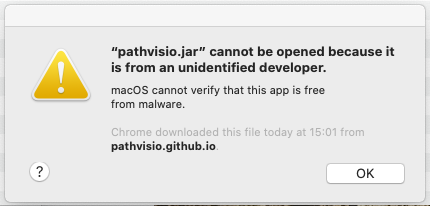
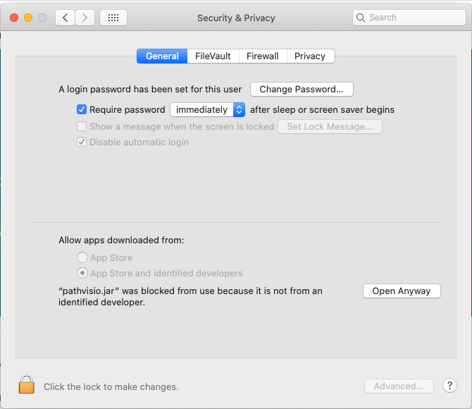
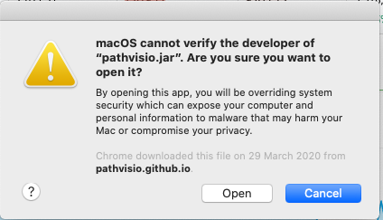
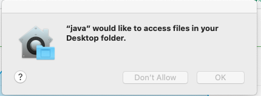

# Installation Guide

* [Binary Installation](#binary-installation)
  * [How to install PathVisio using Windows](#how-to-install-pathvisio-using-windows)
  * [How to install PathVisio using Linux](#how-to-install-pathvisio-using-linux)
  * [How to install PathVisio using Mac](#how-to-install-pathvisio-using-mac) 
* [Homebrew Installation](#homebrew-installation)

## Binary Installation
This is the local installation for PathVisio and the recommended one. The binary and source files for PathVisio and the Webservice Client are released [here](https://pathvisio.github.io/pages/download): PathVisio release. If you want to run PathVisio as a local Java application, download and extract the files.

### How to install PathVisio using Windows:

1. Visit the [Download]( https://pathvisio.github.io/pages/download) page for PathVisio, and click on the link to the current version of PathVisio under “Installations”
2. Unzip the folder to whichever location on your hard drive you wish to access the program from. 
3. Start PathVisio by double-clicking the pathvisio.bat file

### How to install PathVisio using Linux:

1. Visit the [Download]( https://pathvisio.github.io/pages/download) page for PathVisio, and click on the link to the current version of PathVisio under “Installations”
2. Unzip the folder to whichever location on your hard drive you wish to access the program from. 
3. Start PathVisio by running the pathvisio.sh file

### How to install PathVisio using Mac:

1. Visit the [Download]( https://pathvisio.github.io/pages/download) page for PathVisio, and click on the link to the current version of PathVisio under “Installations”
2. Move the Zip file that you downloaded to the location on your hard drive where you wish PathVisio to be accessible from.
3. Unzip the folder by double clicking on it. This process creates a new folder where the program files are located. 
4. Experienced command line users can run the pathvisio.sh file. Other users should double click the pathvisio.jar file.
Double clicking the pathvisio.jar file may give the following error message.

  

5. To solve this, you must open “System Preferences" and click "Security & Privacy" on your device.

  

6. Click the lock (needs system password) and click open anyway. The following dialog appears:

  

7. Click “Open”, and the following dialog appears:

  

8. Click ok, and PathVisio should work on your device. 

## Homebrew Installation
A brew for PathVisio is available from Homebrew on Mac. Before installing make sure you have the latest brews: brew update Then install PathVisio with: brew install homebrew/science/pathvisio Pathvisio is installed into /usr/local/bin. PathVisio can be started with pathvisio from the terminal command line
