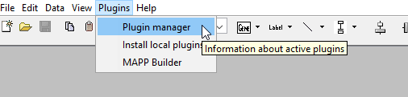
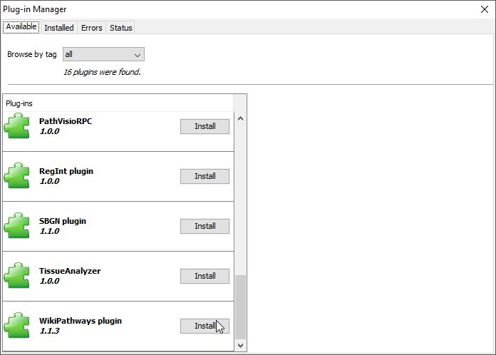
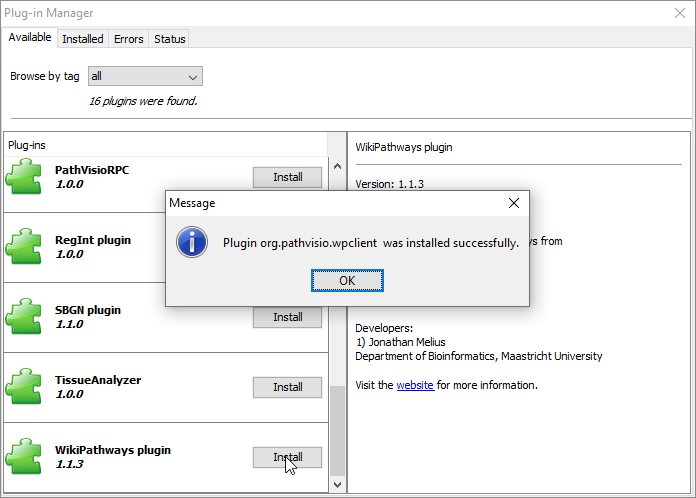
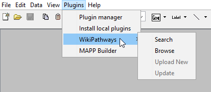
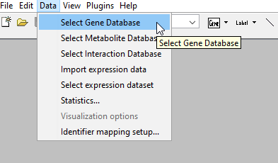

# Getting Started With PathVisio
You have downloaded PathVisio and are ready to get started drawing or editing pathways. 

## Get your WikiPathways user credentials
[WikiPathways](https://www.wikipathways.org/index.php/WikiPathways) is an open biological pathways database that is curated by the community. If you want to create and curate pathways that can be used by the community, you will need a user account. You can create one [here](https://www.wikipathways.org/index.php/Special:UserLogin). In order to upload and curate pathways, you need to [request write access](https://www.wikipathways.org/index.php/Contact_Us).

If you already have a WikiPathways account, you will need to remember your username and password to make any contributions to the WikiPathways database. If you don't remember your password but your credentials are saved on your computer, you can sign in to WikiPathways and navigate to [Special Preferences](https://www.wikipathways.org/index.php/Special:Preferences). There you can change your password. 

## Install the WikiPathways plugin in PathVisio
PathVisio supports a [plugin repository](https://pathvisio.github.io/plugins/plugin-repo). The [WikiPathways plugin](https://pathvisio.github.io/plugins/wikipathways.html) allows the user to browse, search, and update pathways in the WIkiPathways database directly from PathVisio. To install the WikiPathways plugin in PathVisio, follow the steps below:

1. Open PathVisio
2. In the toolbar, click on *Plugins* --> *Plugin manager*

  

3. The Plugin Manager Window will open. In the *Available* tab, scroll down to the WikiPathways plugin and click *Install*

  

4. A pop-up window will alert you when the plugin has been installed successfully. Click OK

  

5. The WikiPathways plugin is now installed. You may need to restart PathVisio to find it in the toolbar.

  

## Select an Identifier Mapping Database
Individual databases have their own unique identifiers for genes, proteins, genetic variants, metabolites, and metabolic reactions. The identifier mapping database [BridgeDb](https://bridgedb.github.io/) makes it possible to map between the different biological databases. PathVisio can make use of the mapping data. 

The latest linksets for multiple species are available for download [here](https://bridgedb.github.io/data/gene_database/). Download the linksets you need. For example, the Gene / Protein ID mapping linkset starting with "Hs" is the human linkset. You can additionally download the Interaction and Metabolite ID mapping databases.

To use the Gene / Protein ID mapping database in PathVisio, click *Data* in the toolbar, and press *Select Gene Mapping Database*

  

You can see whether the database was properly selected in the bottom left corner. After "Gene Database" you should see the name of the database you just selected.

  

You can also select the Interaction and Metabolite ID mapping databases in the same way, but click either *Select Interaction Database* or *Select Metabolite Database*, respectively.

You're now ready to get started creating and curating pathways!

