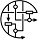

# PathVisio plugin repository

|      | Plugins                           | 
| -------- | :---------------------------------: |
|  | [BioPAX plugin](biopax.md) | 
|  | [BridgeDb plugin](bridgedb.md) | 
|  | [ComplexViz plugin](complexviz.md) | 
|  | [FindYourInteraction plugin](fyi.md) | 
|  | [GO plugin](go.md) | 
|  | [GSEA plugin](gsea.md) | 
|  | [HTML export plugin](html.md) | 
|  | [MAPPBuilder plugin](mappbuilder.md) | 
|  | [MiniMap plugin](minimap.md) | 
|  | [NimWiz plugin](nimwiz.md) | 
|  | [PathSBML plugin](pathsbml.md) | 
|  | [PathVisioRPC plugin](pathvisiorpc.md) | 
|  | [QuickSearch plugin](quicksearch.md) | 
|  | [RegInt plugin](regint.md) | 
|  | [SBGN plugin](sbgn.md) | 
|  | [TissueAnalyzer plugin](tissueanalyzer.md) | 
|  | [TypeConverter plugin](typeconverter.md) | 
|  | [WikiPathways plugin](wikipathways.md) |
