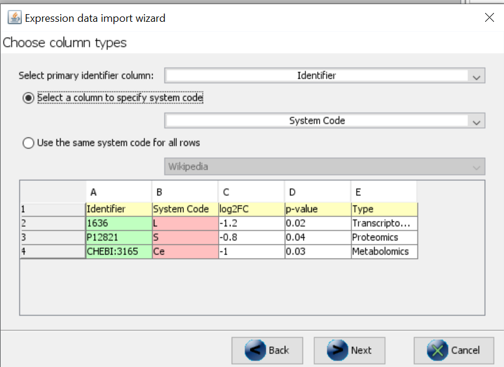
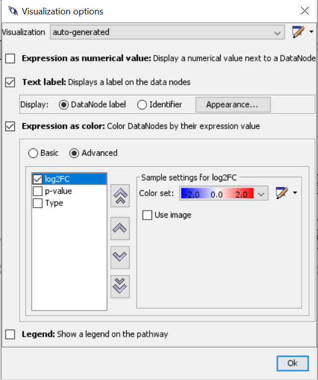
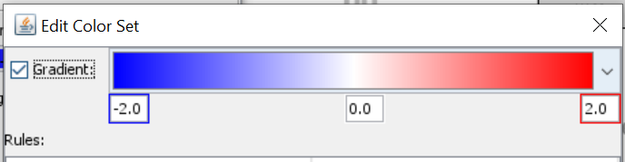
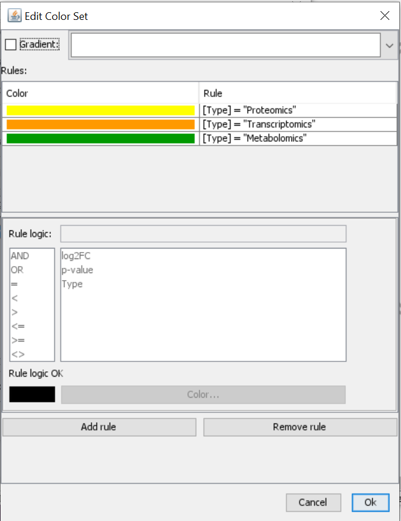
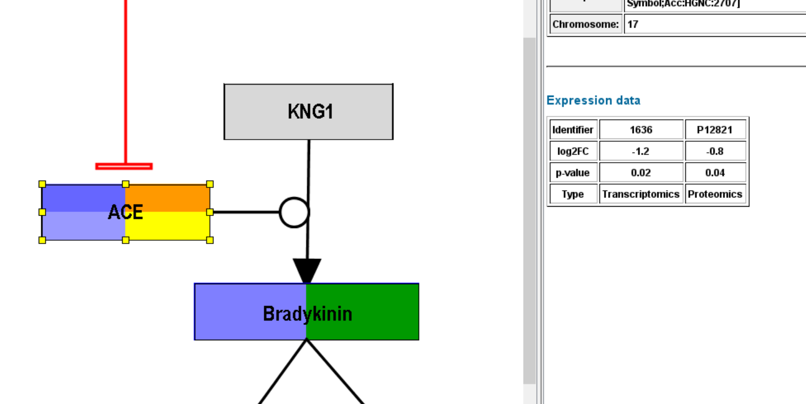

# Tutorial: Multi-omics data visualziation with PathVisio

* *Author:* [Martina Summer-Kutmon](https://github.com/mkutmon)
* *Date:* 2020-04-23

If you want to visualize different omics data types together on a pathway diagram, there are a couple of steps you need to follow. You first need to prepare your data file in the correct way (step 1), then you need to import your data (step 2) and lastly, you need to create an intuitive visualization (step 3). 

----

## Step 1: Prepare your data
All data needs to be combined in one data file. Very likely, you are using different identifiers for your different measurements (e.g. Entrez Gene for transcriptomics, UniProt for proteomics and ChEBI for metabolomics). Each identifier needs to be accompanied by the appropriate [database/system code](https://bridgedb.github.io/pages/system-codes.html). Additionally, we advise to add a type column, indicating what data type/experiment the measurement comes from. The data file should look something like this. 

| Identifier  | System Code | log2FC | p-value | Type |
| ------------- | ------------- | ------------- | ------------- | ------------- |
| 1636 | L  | -1.2 | 0.02 | Transcriptomics |
| P12821  | S  | -0.8 | 0.04 | Proteomics |
| CHEBI:3165| Ce | -1.0 | 0.03 | Metabolomics |

You can also combine multiple Transcriptomics datasets this way but if all identifiers are from the same database, then the system code column is not needed. 

## Step 2: Import your data
* Open PathVisio
* Open a pathway of interest. 
* Make sure the correct identifier mapping databases are loaded (species-specific gene and/or metabolite mapping databases)
* Data > Import Expression Data
* Follow the wizard and make sure to select the system code column in the "Choose column types" dialog. 

  

After successful importing the data (identifiers were recognized), you should some default visualization on the nodes with data. 

----

## Step 3: Create a visualization

Now it is important to create an intuitive visualization. As an example, we will create an advanced visualization and define a gradient-based visualization for the log2FC and a rule-based visualization for the Type. 

* Data > Visualization options
* Create new visualization in the top right of the dialog
* Select "Text label"
* Select "Expression as color" > "Advanced"

  

* Select log2FC and create new colore set using a color gradient from blue to red.

  

* Next, you select Type and create a new color set. Click on "Add rule" > Define rule logic and select color. Repeat for all types that you have and give them unique color codes (ideally different from the log2FC gradient).

  

* The visualization has been adapted and you can see multiple rows in the gene product which has a transcriptomics (orange type) and proteomics (yellow) measurement, but you can also see color on the metabolite which also has a corresponding measurement in the expression data file. 

  

